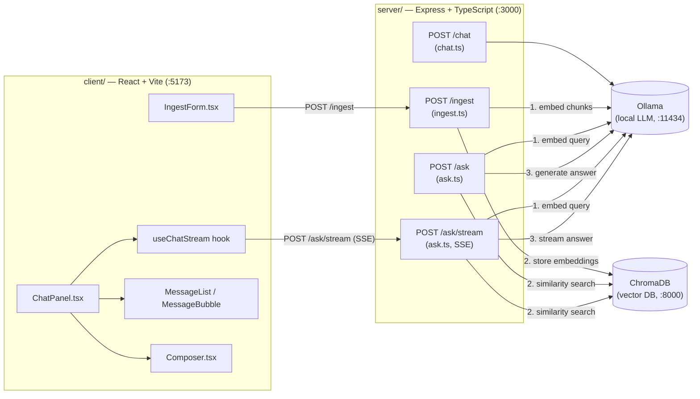

# Local RAG API with LangChain

A locally-run RAG chat API built with Express, LangChain, and Ollama — no
cloud LLM calls, no API keys. ChromaDB stores document embeddings so answers
can be grounded in and cite your own documents, streamed back over SSE.

## Architecture



- **`client/`** — React + Vite single-page UI with an ingest form
  ([IngestForm.tsx](client/src/components/IngestForm.tsx)) and a chat panel
  ([ChatPanel.tsx](client/src/components/ChatPanel.tsx)) composed from a
  streaming hook ([useChatStream.ts](client/src/hooks/useChatStream.ts)) and
  three presentational components
  ([MessageList.tsx](client/src/components/MessageList.tsx),
  [MessageBubble.tsx](client/src/components/MessageBubble.tsx),
  [Composer.tsx](client/src/components/Composer.tsx)). Vite's dev server
  proxies `/chat`, `/ingest`, and `/ask` to the backend so there's no CORS
  setup needed in dev ([vite.config.ts](client/vite.config.ts)).
- **`server/`** — Express + TypeScript API with four routes:
  - `POST /chat` ([chat.ts](server/src/routes/chat.ts)) — builds a LangChain
    prompt (system + user message), sends it to a local Ollama model via
    `ChatOllama`, and returns the plain-text answer as JSON. No document
    retrieval. **Not called by the UI anymore** — kept as the Step 2
    "naive chat" baseline, for comparison against `/ask`'s retrieval-grounded
    answers.
  - `POST /ingest` ([ingest.ts](server/src/routes/ingest.ts)) — reads
    Markdown files from a given directory, splits them into chunks, embeds
    them with `nomic-embed-text`, and stores them in ChromaDB.
  - `POST /ask` ([ask.ts](server/src/routes/ask.ts)) — a retrieval chain
    that embeds the question, fetches the top-matching chunks from
    ChromaDB, and answers using only that context in a single JSON
    response, citing sources.
  - `POST /ask/stream` ([ask.ts](server/src/routes/ask.ts)) — the streaming
    counterpart to `/ask`: same retrieval, but tokens are sent to the client
    over Server-Sent Events as they're generated, and a per-`sessionId` chat
    history is kept in memory so follow-up questions have context. This is
    the endpoint the chat UI actually calls.
- **Ollama** — runs the LLM itself (`llama3.1` by default) locally. The
  server talks to it over HTTP; it isn't a dependency you `npm install`.
- **ChromaDB** — a vector DB, run via Docker
  ([docker-compose.yml](docker-compose.yml)), for storing document
  embeddings written by `/ingest` and read by `/ask` and `/ask/stream`.

## Prerequisites

- **Node.js** (v20+ recommended)
- **[Ollama](https://ollama.com)** installed and running, with a chat model
  pulled:
  ```
  ollama pull llama3.1
  ```
- **Docker** (only needed once ChromaDB is actually used by the app)

## Running the app

From the repo root:

```
npm install       # installs concurrently (root dev-runner)
npm run dev
```

This starts the backend (`:3000`) and frontend (`:5173`) together, with
`[server]`/`[client]` prefixed logs. Open **http://localhost:5173** to chat.

`Ctrl+C` stops both.

Ollama isn't included in that script — most installs auto-start an Ollama
background service/tray app on boot. If yours isn't running, start it
separately with `ollama serve` before using the chat UI.

### Running services individually

```
cd server && npm install && npm run dev   # API on :3000
cd client && npm install && npm run dev   # UI on :5173
docker compose up -d                      # ChromaDB on :8000
```

## Status

This project follows a step-by-step tutorial and is a work in progress:

- ✅ Ollama + ChromaDB + TypeScript project set up
- ✅ Naive chat endpoint (`POST /chat`) — no document retrieval yet
- ✅ Ingest documents into ChromaDB (`POST /ingest`, `server/docs/`)
- ✅ Retrieval chain with cited sources (`POST /ask`)
- ✅ Streamed responses (SSE) + conversation history (`POST /ask/stream`,
  used by the chat UI)
- ⬜ PDF document support

The `server/docs/` folder holds sample documents you can point `/ingest` at.

## Glossary

Shortforms used in this README and codebase:

| Term | Meaning |
| --- | --- |
| **CORS** | Cross-Origin Resource Sharing |
| **DB** | Database (ChromaDB is the vector DB here) |
| **JSON** | JavaScript Object Notation |
| **LCEL** | LangChain Expression Language — the `.pipe()` syntax used to chain prompt → model → parser |
| **RAG** | Retrieval-Augmented Generation — answering questions using retrieved document context instead of the model's training data alone |
| **SSE** | Server-Sent Events — a one-way streaming protocol over HTTP |
